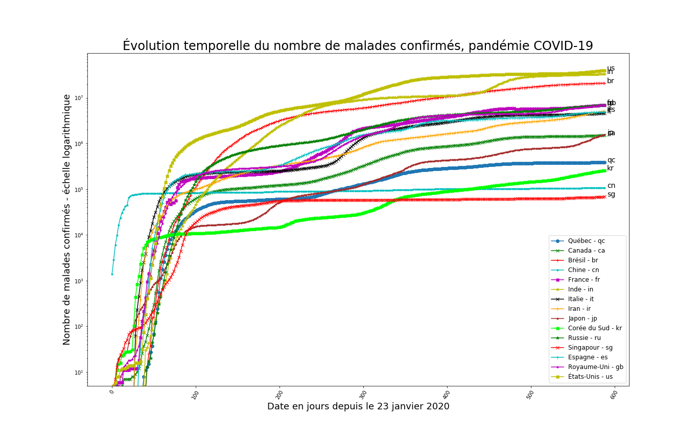
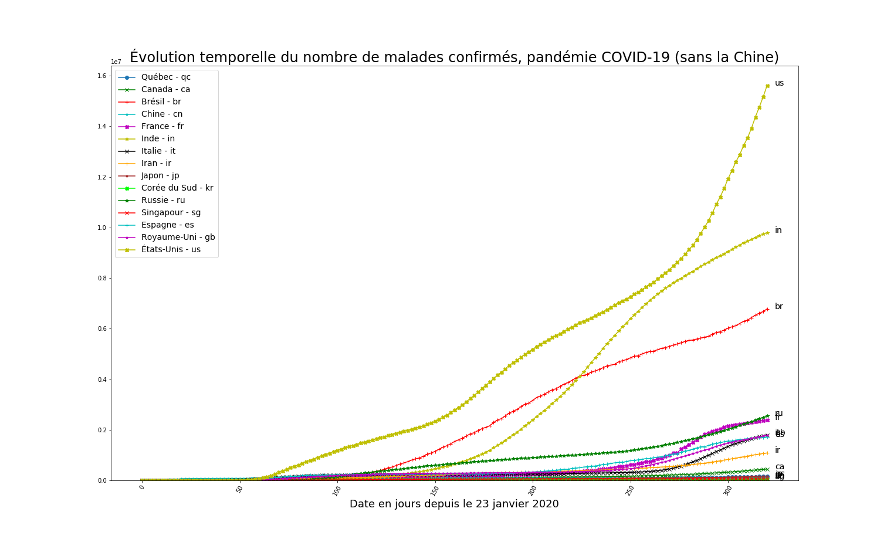
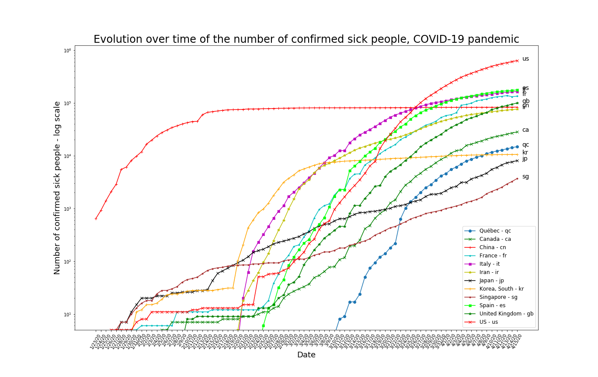
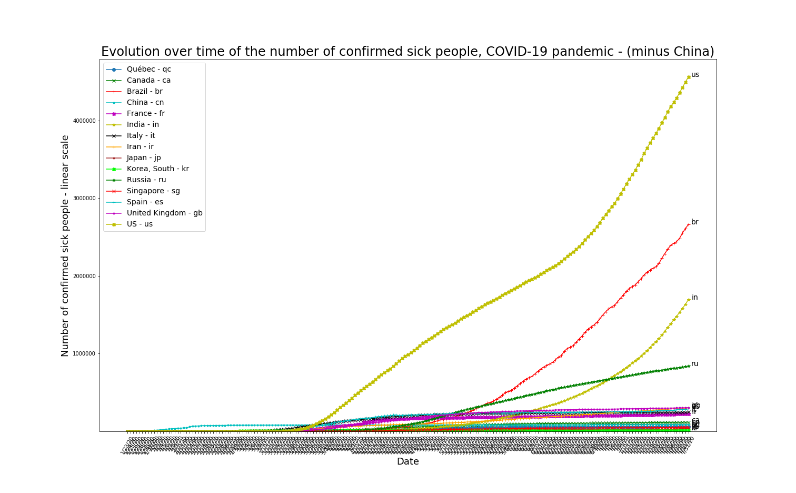
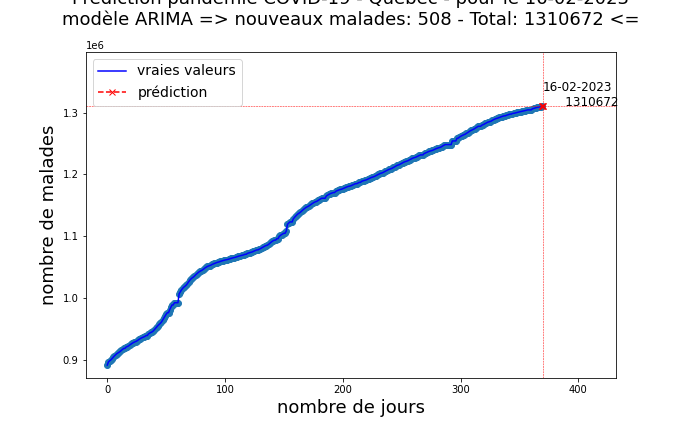
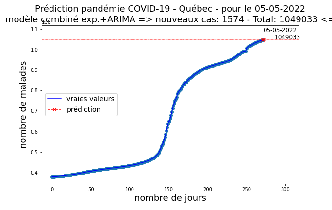
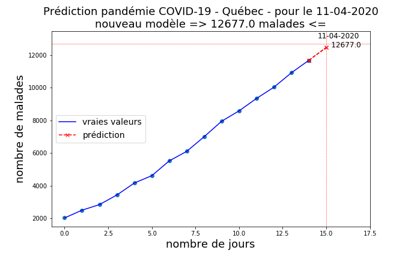

# Evolution de la pandémie du COVID-19 - (English below)

Petit exercice d'exploration et de visualisation simple des donnees de l'évolution temporelle de la pandémie du COVID-19

## Outils

Carnet web IPython / Jupyter

Bibliothèques NumPy, Pandas, matplotlib et Jupyter / IPython

## Données

Dépôt de données ouvertes du COVID-19 - John Hopkins University - CSSE

https://github.com/CSSEGISandData/COVID-19

**NOTE**: Les données contenues dans le répertoire DATA doivent être mises à jour régulièrement pour réfléter l'évolution dans le temps.

## Licence

Copyright (C) 2020 - Claude COULOMBE

Sous licence Apache, Version 2.0 (la "Licence");

Vous ne pouvez pas utiliser ce fichier, sauf conformément avec la licence.
Vous pouvez obtenir une copie de la Licence sur
http://www.apache.org/licenses/LICENSE-2.0

Sauf si requis par la loi en vigueur ou par accord écrit, le logiciel distribué sous la licence est distribué "TEL QUEL", 
SANS GARANTIE NI CONDITION DE QUELQUE NATURE QUE CE SOIT, implicite ou explicite. Consultez la Licence pour connaitre
la terminologie spécifique régissant les autorisations et les limites prévues par la licence.

# ------------------------------------------------------------

# Evolution of the COVID-19 pandemic

Small exercise of data exploration and visualization of the evolution over time of the COVID-19 pandemic.

IPython / Jupyter Notebook

Libraries: NumPy, Pandas, matplotlib, and Jupyter / IPython

## Data

Open data repository COVID-19 (2019-nCoV) by Johns Hopkins University - CSSE

https://github.com/CSSEGISandData/COVID-19

**NOTE**: The COVID-19 data contained in the DATA directory must be updated regularly to reflect changes over time.

## Licensee

Copyright (C) 2020 - Claude COULOMBE

Licensed under the Apache License, Version 2.0 (the 'License');
you may not use this file except in compliance with the License.
You may obtain a copy of the License at [Apache 2.0 License](http://www.apache.org/licenses/LICENSE-2.0).

**Unless required by applicable law or agreed to in writing, software distributed under the License is distributed on 
an 'AS IS' BASIS, WITHOUT WARRANTIES OR CONDITIONS OF ANY KIND, either express or implied. 
See the License for the specific language governing permissions and limitations under the License.**

# ------------------------------------------------------------        

# Modèle prédictif de la pandémie du COVID-19 au Québec

Petit exercice de prédiction de l'évolution temporelle de la pandémie du COVID-19 sur le territoire du Québec.

Pour contrer l'anxiété de la pandémie de COVID-19, rien de mieux que d'agir. J'ai donc préparé un petit carnet Web Python, prétexte pour un petit exercice d'exploration de données avec Pandas puis un carnet web IPython avec des modèles prédictifs. 

Le modèle résultant est une combinaison de modèles ARIMA et d'un modèle de régression non linéaire. ARIMA est un acronyme qui signifie AutoRegressive Integrated Moving Average, en français modèle de moyenne mobile autorégressive.

**Attention!** Je ne suis pas épidémiologiste! Il s'agit d'un exercice «amateur» réalisé comme un loisir scientifique. Je suis ouvert à la discussion pour améliorer mes modèles et pour le plaisir d'apprendre. Aussi ces modèles ne sont bons que pour faire des prédictions à court terme. Par exemple. pour prédire un cycle épidémique, un modèle ARIMA ou d'ajustement de courbes doit disposer d'au moins un cycle complet de données. 

Une autre approche consisterait à se baser sur le comportement de l'épidémie en Chine et ajuster les paramètres aux données locales. J'ignore toutefois si cela donnerait des résultats fiables. 

**Note:** Pour faire des prédictions plus complètes et à plus long terme, des simulations avec des modèles mathématiques à base d'équations différentielles seraient plus appropriées (https://bit.ly/2JEMe3g). D'ailleurs certains paramètres de ces modèles peuvent être extraits des données. Pour avoir une idée du fonctionnment de tels modèles, avec des simulations-jouets, allez voir les capsules vidéos de Grant Sanderson (3Blue1Brown), mon infographiste scientifique préféré: https://bit.ly/33Umjhe

Commentaire publié dans l'Actualité du 30 mars 2020: https://bit.ly/3dIOvYK

## Outils

Carnet web IPython / Jupyter

Bibliothèques NumPy, Pandas, ScyPy, Sklearn, pyramid-arima, statsmodels, matplotlib et Jupyter / IPython, 

## Données

Dépôt de données ouvertes du COVID-19 - John Hopkins University - CSSE

https://github.com/CSSEGISandData/COVID-19

**NOTE**: Les données contenues dans le répertoire DATA doivent être mises à jour régulièrement pour réfléter l'évolution dans le temps.

## Licence

Copyright (C) 2020 - Claude COULOMBE

Sous licence Apache, Version 2.0 (la "Licence");

Vous ne pouvez pas utiliser ce fichier, sauf conformément avec la licence.
Vous pouvez obtenir une copie de la Licence sur
http://www.apache.org/licenses/LICENSE-2.0

Sauf si requis par la loi en vigueur ou par accord écrit, le logiciel distribué sous la licence est distribué "TEL QUEL", SANS GARANTIE NI CONDITION DE QUELQUE NATURE QUE CE SOIT, implicite ou explicite. Consultez la Licence pour connaitre la terminologie spécifique régissant les autorisations et les limites prévues par la licence.

## Modèle meilleurs ARIMA seulement

À ce stade de l'évolution de la pandémie au Québec, il semble bien qu'un modèle ARIMA soit maintenant le plus susceptible de faire de bonnes prédictions, du moins à court terme.

## Modèle combiné meilleurs ARIMA + régression non-linéaire avec exponentielle

Depuis quelques jours, le modèle combiné semble moins pertinent au fur et à mesure que l'on s'éloigne d'une évolution exponentielle.

# Nouveau modèle ?

En observant le comportement de mes modèles depuis quelques jours, je suis tenté de faire une moyenne entre les résultats de mes deux principaux modèles, i.e. (modèle combiné + modèle pur ARIMA)/2

# ------------------------------------------------------------        
