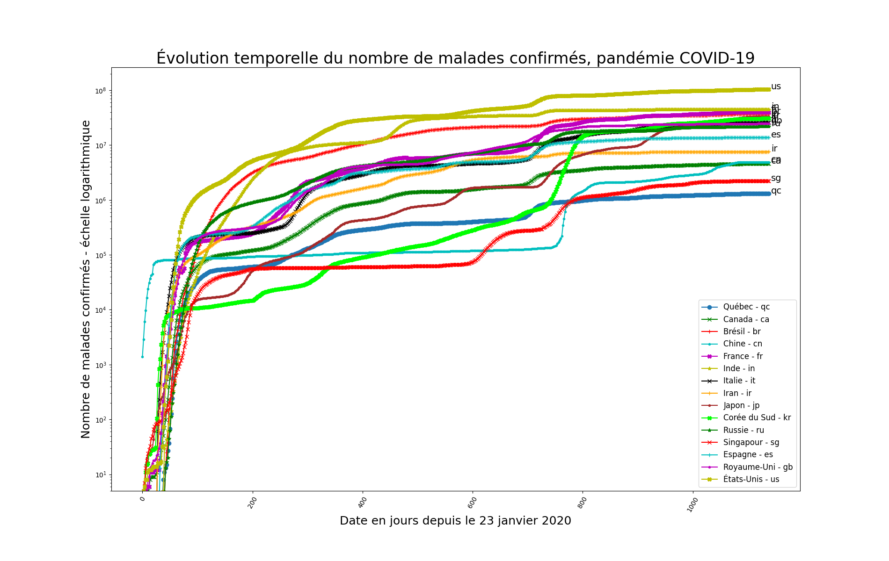

# Evolution de la pandémie du COVID-19 - (English below)

Petit exercice d'exploration et de visualisation simple des donnees de l'évolution temporelle de la pandémie du COVID-19

## Outils

Carnet web IPython / Jupyter

Bibliothèques NumPy, Pandas, matplotlib et Jupyter / IPython

## Données

Dépôt de données ouvertes du COVID-19 - John Hopkins University - CSSE

https://github.com/CSSEGISandData/COVID-19

**NOTE**: Les données contenues dans le répertoire DATA doivent être mise à jour régulièrement pour réfléter l'évolution dans le temps.

## Licence

Copyright (C) 2020 - Claude COULOMBE

Sous licence Apache, Version 2.0 (la "Licence");

Vous ne pouvez pas utiliser ce fichier, sauf conformément avec la licence.
Vous pouvez obtenir une copie de la Licence sur
http://www.apache.org/licenses/LICENSE-2.0

Sauf si requis par la loi en vigueur ou par accord écrit, le logiciel distribué sous la licence est distribué "TEL QUEL", 
SANS GARANTIE NI CONDITION DE QUELQUE NATURE QUE CE SOIT, implicite ou explicite. Consultez la Licence pour connaitre
la terminologie spécifique régissant les autorisations et les limites prévues par la licence.

# ------------------------------------------------------------

# Evolution of the COVID-19 pandemic

Small exercise of data exploration and visualization of the evolution over time of the COVID-19 pandemic.

IPython / Jupyter Notebook

Libraries: NumPy, Pandas, matplotlib, and Jupyter / IPython

## Data

Open data repository COVID-19 (2019-nCoV) by Johns Hopkins University - CSSE

https://github.com/CSSEGISandData/COVID-19

**NOTE**: The COVID-19 data contained in the DATA directory must be updated regularly to reflect changes over time.

## Licensee

Copyright (C) 2020 - Claude COULOMBE

Licensed under the Apache License, Version 2.0 (the 'License');
you may not use this file except in compliance with the License.
You may obtain a copy of the License at [Apache 2.0 License](http://www.apache.org/licenses/LICENSE-2.0).

**Unless required by applicable law or agreed to in writing, software distributed under the License is distributed on 
an 'AS IS' BASIS, WITHOUT WARRANTIES OR CONDITIONS OF ANY KIND, either express or implied. 
See the License for the specific language governing permissions and limitations under the License.**

# ------------------------------------------------------------        

